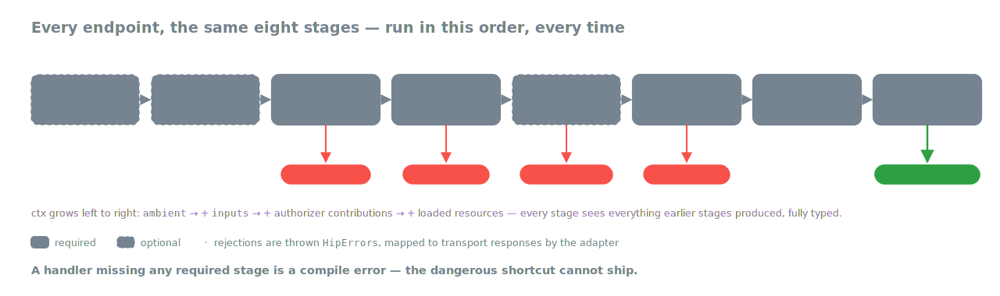

# HipThrusTS

[](https://github.com/trycatchal/hipthrusts/actions/workflows/ci.yml)
[](https://www.npmjs.com/package/hipthrusts)
[](./LICENSE)

**Secure-by-default request handlers for Node.js APIs.**

Every secure endpoint does the same things: validate inputs, authorize,
load resources, do the work, redact the response. Most frameworks make
all of them optional — the handler that forgets one still compiles,
still ships, and shows up six months later as a privilege-escalation
report. HipThrusTS makes the stages **the unit of work**, and makes the
required ones impossible to skip:



It sits on top of the framework you already use — Express, tRPC, Hono,
Fastify, or Next.js (App Router). It doesn't replace your router, your
ORM, or your auth layer — it gives the per-request handler a backbone.

```ts
import { toExpressHandler } from 'hipthrusts/express';

app.get('/things/:id', toExpressHandler({
  extractAmbient:  (raw)    => ({ user: raw.req.user }),
  sanitizeInputs:  (inputs) => ({ id: String(inputs.params.id) }),
  preAuthorize:    (ctx)   => ctx.ambient.user?.role === 'reader',
  loadResources:   async (ctx) => ({
    thing: await ThingModel.findById(ctx.inputs.id).exec(),
  }),
  finalAuthorize:  (ctx)   =>
    !!ctx.thing && ctx.thing.ownerId === ctx.ambient.user.id,
  execute:         (ctx)   => ctx.thing,
  redactResponse:  (thing) => ({ id: thing.id, name: thing.name }),
}));
```

Delete any of the five required stages and TypeScript fails the build.
Throw a `HipError` (`HipNotFound`, `HipForbidden`, …) from any stage and
the adapter translates it to the right HTTP response — without leaking
error details to the caller.

You'll like HipThrusTS if you're building a Node.js API with a data
model, untrusted clients, and at least one of these concerns:

- resource-level access control (owner-only, role-based, assignee-based)
- field-level permissions (some fields are read-only for some callers)
- response redaction (passwords, tokens, internal flags must never leak)
- making security review of every endpoint mechanical, not human

## The context only grows

Each stage receives everything earlier stages produced and layers on its
own contribution — `ctx.ambient` from extraction, `ctx.inputs` from
sanitization, loaded resources and authorizer outputs at the top level.
An `execute` at the end of a long chain reaches all of it, fully typed:


An authorizer can even do its check and contribute at the same time —
return `{ isOwner: true }` instead of `true`, and downstream stages see
`ctx.isOwner`.

## Compose, don't repeat yourself

The real payoff shows up the second time you need "load a Thing by ID,
require the caller to own it." Write it once as a fragment, then `HTPipe`
it into every endpoint that needs it:

```ts
import { HTPipe, LoadResources, FinalAuthorize } from 'hipthrusts';

export const RequireThingOwner = HTPipe(
  LoadResources(async (ctx: { inputs: { params: { id: string } } }) => ({
    thing: await ThingModel.findById(ctx.inputs.params.id).exec(),
  })),
  FinalAuthorize((ctx: { thing: any; ambient: { user: { id: string } } }) =>
    ctx.thing && ctx.thing.ownerId === ctx.ambient.user.id
      ? { isOwner: true as const }
      : false,
  ),
);

// every owner-gated endpoint is now a few lines
// (WithUserFromReq / SanitizeThingParams: shared fragments, see the docs):
app.put('/things/:id', toExpressHandler(HTPipe(
  WithUserFromReq, SanitizeThingParams, RequireThingOwner,
  {
    preAuthorize:   (ctx) => ctx.ambient.user?.role === 'editor',
    execute:        async (ctx) => { ctx.thing.name = ctx.inputs.body.name; return ctx.thing.save(); },
    redactResponse: (t) => ({ id: t.id, name: t.name }),
  },
)));
```

The merge is stage by stage — each lifecycle stage sweeps across every
fragment that declares it, and the composed result is itself a fragment:


A stage that consumes a context key nothing upstream provides is a
**compile error** (a named `HipDepNotMet<'stage', 'key'>` marker), so a
pipe can't silently lose its auth or its data. Full details, including
shared partial pipelines and the zero-annotation `finishPipe` helper:
[docs/composition.md](./docs/composition.md).

## Install

```sh
pnpm add hipthrusts
# peer-installs depending on what you'll use:
pnpm add express              # Express adapter
pnpm add hono                 # Hono adapter
pnpm add fastify              # Fastify adapter
pnpm add next                 # Next.js (App Router) adapter
pnpm add zod                  # Zod-based validation helpers
pnpm add mongoose json-mask   # Mongoose helpers
```

Ships ESM + CommonJS, root and every subpath (`hipthrusts/express`,
`hipthrusts/zod`, …). Node.js >= 20. Subpath types resolve through the
package `exports` map, so use `"moduleResolution": "node16"`,
`"nodenext"`, or `"bundler"` in your `tsconfig.json` — the legacy
`"node"` (node10) resolution cannot see the subpath type declarations.

## Documentation

| Guide | What's in it |
|-------|--------------|
| [The lifecycle, in detail](./docs/lifecycle.md) | All eight stages, the context each receives, input slices & the strictness guarantee |
| [Composition](./docs/composition.md) | `HTPipe`, shared fragments, partial pipelines, `finishPipe`, type troubleshooting |
| [Errors & failure routing](./docs/errors.md) | The `HipError` vocabulary, error bodies, unexpected-error routing, the auth-before-validation gate |
| [Adapters](./docs/adapters.md) | Express, tRPC, Hono, Fastify, Next.js; `responseMeta`, `onError` / `afterResponse` options |
| [Zod validation helpers](./docs/validation.md) | Schema-backed sanitization & redaction, codec-style wire schemas, switches |
| [Mongoose helpers & data loading](./docs/mongoose.md) | Everyday loaders, `ctxRef`, tenant scoping for list endpoints |

Plus the generated [API reference](https://trycatchal.github.io/hipthrusts/)
(every export, from source) and [runnable examples](./examples) — a
hello-world per adapter:

```sh
pnpm exec tsx examples/express-hello.ts
```

## No magic

The helpers (`HTPipe`, `LoadResources`, the `htZodFactory` family) all
just produce or compose plain objects — a handler is data; the adapter
executes it. Here's the opening example written longhand, with nothing
but built-in TypeScript:

```ts
import { HipBadInputs, HipForbidden, HipNotFound } from 'hipthrusts';
import { toExpressHandler } from 'hipthrusts/express';

app.get('/things/:id', toExpressHandler({
  extractAmbient: (raw) => ({ user: raw.req.user }),
  sanitizeInputs: (inputs) => {
    if (typeof inputs.params?.id !== 'string') {
      throw new HipBadInputs('id must be a string');
    }
    return { id: inputs.params.id };
  },
  preAuthorize: (ctx) => ctx.ambient.user?.role === 'reader',
  loadResources: async (ctx) => {
    const thing = await ThingModel.findById(ctx.inputs.id).exec();
    if (!thing) throw new HipNotFound('Thing not found');
    return { thing };
  },
  finalAuthorize: (ctx) => {
    if (ctx.thing.ownerId !== ctx.ambient.user.id) {
      throw new HipForbidden();
    }
    return true;
  },
  execute: (ctx) => ctx.thing,
  redactResponse: (thing) => ({ id: thing.id, name: thing.name }),
}));
```

## Philosophy

- **Secure by default, not by convention.** The compiler enforces the
  required stages; reviewers don't have to.
- **Reusable, not opaque.** Common patterns (ownership, role checks,
  populate-this-resource) become named fragments you compose. No magic
  decorators, no global state.
- **Stay out of your way.** No DI container, no ambient providers, no
  "framework runtime." A handler is data; the adapter executes it.
- **Lean on what works.** Mongoose is great at schema validation. Zod is
  great at parsing. Express, Hono, Fastify, and Next.js are great at
  routing. HipThrusTS doesn't reimplement any of them.

It's intentionally an **add-on**, not a replacement: keep your router,
your auth middleware, your ORM. Wrap individual handlers where the
security shape matters — and because every handler has the same shape, a
security review of one endpoint teaches you how to read every other
endpoint in the codebase.

## FAQ

**Do I really need five functions per endpoint?**
Yes — but authorization and data-loading patterns repeat. Share them as
`HTPipe` fragments and per-endpoint code shrinks to just
`sanitizeInputs`, `execute`, and `redactResponse` for most handlers.

**What if my route isn't CRUD?**
The stages don't constrain what `execute` does. Most non-CRUD endpoints
just have an unusual `execute` — webhooks, computation, third-party API
calls. The security shape stays the same.

**How is `ctx.ambient` different from `ctx.inputs`?**
`ctx.ambient` is **trusted** data lifted from the request envelope (the
authenticated principal, request ID) — it doesn't go through validation.
`ctx.inputs` is the *validated* shape of untrusted user-supplied data.
The split tells reviewers at a glance which is which.

**How do I throw an error?**
Throw a `HipError` subclass — `HipNotFound`, `HipBadInputs`,
`HipForbidden`, etc. Each adapter translates it to the right
framework-native response. For a redirect, throw `new HipRedirect(url)`.
More in [Errors & failure routing](./docs/errors.md).

## Roadmap

More adapters (Koa), more ODM integrations (Prisma, Drizzle, TypeORM), a
higher-level "resource recipe" layer, a starter template — see
[ROADMAP.md](./ROADMAP.md). HipThrusTS is stable as of 1.0.0 and follows
[semantic versioning](https://semver.org): breaking changes land only in
major releases. PRs welcome — see [CONTRIBUTING.md](./CONTRIBUTING.md).

## License

MIT.

## About the name

A hip thrust is an exercise — invented by Dr. Bret Contreras — that
strengthens the glutes. This library strengthens your back end. The pun
was approved by Dr. Contreras himself; if fitness is your thing, check
out [his work](https://bretcontreras.com/).
