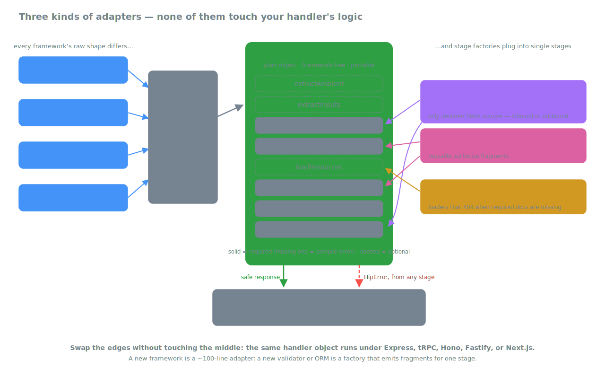

# Adapters

*Part of the [HipThrusTS docs](./README.md) · [← back to the overview](../README.md)*

The middle is framework-free; only the edges know what framework you're
on. **Endpoint adapters** (~100 lines each) canonicalize the raw request
on the way in and translate the outcome on the way out. **Stage
factories** — Zod for validating inputs and redacting responses against
schemas, Mongoose for loading, role/assignee helpers for authorization —
emit fragments for one specific stage. The same handler object runs
unchanged under any of them.



## HTTP response metadata

HTTP-style adapters (Express, Hono, Fastify, Next.js) accept an optional
`responseMeta` field on the handler config. Use it for non-200 statuses
or response headers without leaving the declarative shape:

```ts
toExpressHandler({
  sanitizeInputs:  (i) => i,
  preAuthorize:    () => true,
  finalAuthorize:  () => true,
  execute:         (ctx) => ThingModel.create(ctx.inputs.body),
  redactResponse:  (t) => ({ id: t.id, name: t.name }),
  responseMeta:    (ctx) => ({
    status: 201,
    headers: { Location: `/things/${ctx.response.id}` },
  }),
});
```

`responseMeta` can be a static object (`{ status: 201 }`) or a function
of the final context. tRPC has no `responseMeta` — procedures return
values, not HTTP responses.

`responseMeta` (like any non-stage key) passes through `HTPipe`
composition with right-wins semantics, so it can live on any fragment.

## Adapter options

Every HTTP adapter (`toExpressHandler`, `toHonoHandler`,
`toFastifyHandler`, `toNextHandler`) takes an options object as its
second argument:

```ts
toNextHandler(handler, {
  // Called with every error the adapter converts to an error response
  // (redirects excluded). For unexpected failures, error.cause carries
  // the original underlying error. A throwing hook never affects the
  // response. Errors thrown from afterResponse also land here, tagged
  // with info.phase === 'afterResponse' — a failed audit write is
  // observable even though the response was already sent.
  onError: (error, { raw, phase }) => logger.error({ err: error, phase }),

  // Post-response side effects with the FINAL lifecycle context —
  // inputs, ambient, loaded resources, and the response. Fires only
  // after a successful lifecycle; never blocks or breaks the response
  // (failures are routed to onError, above).
  afterResponse: async (ctx) => auditLog.write({ input: ctx.inputs, out: ctx.response }),
});
```

Repeating the same options on every route? Each adapter exports a preset
factory — `makeExpressHandlerFactory`, `makeHonoHandlerFactory`,
`makeFastifyHandlerFactory`, `makeNextHandlerFactory` — that bakes
defaults into a reusable converter (per-call options merge over them):

```ts
export const toAppHandler = makeNextHandlerFactory({ gatherContext, onError });
// ...
export const GET = toAppHandler(handler); // no repeated { gatherContext }
```

The Next.js and Hono adapters (which parse JSON bodies themselves)
additionally reject non-empty bodies that fail to parse with a
`422 { "error": "Malformed JSON body" }` — pass
`allowMalformedBody: true` to coerce them to `{}` instead. Empty bodies
always coerce to `{}`. (Express and Fastify body parsing is configured
in the framework.)

The Next.js adapter also keeps its `gatherContext` option for merging
async request context (e.g. the auth principal) into the raw envelope.


## tRPC adapter

The same handler config works with tRPC; only the adapter changes:

```ts
import { toTrpcProcedure } from 'hipthrusts/trpc';

export const updateThing = t.procedure
  .input(z.object({ id: z.string(), name: z.string() }))
  .mutation(toTrpcProcedure({
    extractAmbient:  (raw) => ({ user: raw.ctx.user }),
    sanitizeInputs:  (i)   => i,
    preAuthorize:    (ctx) => !!ctx.ambient.user,
    finalAuthorize:  ()    => true,
    execute:         async (ctx) =>
      ThingModel.findByIdAndUpdate(ctx.inputs.id, { name: ctx.inputs.name }),
    redactResponse:  (t)   => ({ id: t.id, name: t.name }),
  }));
```

The lifecycle, the type-checking, the failure routing — all identical
to the Express path. Anything reusable you build (auth fragments,
ownership checks, response shapers) works across both.

## Hono adapter

```ts
import { Hono } from 'hono';
import { toHonoHandler } from 'hipthrusts/hono';

const app = new Hono();

app.get('/things/:id', toHonoHandler({
  extractAmbient:  (raw)    => ({ user: raw.c.get('user') }),
  sanitizeInputs:  (inputs) => ({ id: String(inputs.params.id) }),
  preAuthorize:    (ctx) => !!ctx.ambient.user,
  loadResources:   async (ctx) => ({
    thing: await ThingModel.findById(ctx.inputs.id).exec(),
  }),
  finalAuthorize:  (ctx) => ctx.thing?.ownerId === ctx.ambient.user.id,
  execute:         (ctx) => ctx.thing,
  redactResponse:  (t)   => ({ id: t.id, name: t.name }),
}));
```

The adapter parses the JSON body for non-`GET`/`HEAD`/`DELETE` methods
before the synchronous lifecycle runs; the handler always sees the
parsed value in `raw.body`. The hono `Context` is available as `raw.c`
if you need it (e.g. cookies, session middleware values).

## Fastify adapter

```ts
import Fastify from 'fastify';
import { toFastifyHandler } from 'hipthrusts/fastify';

const app = Fastify();

app.put('/things/:id', toFastifyHandler({
  extractAmbient:  (raw)    => ({ user: (raw.req as any).user }),
  sanitizeInputs:  (inputs) => ({
    id:   String(inputs.params.id),
    name: String((inputs.body as any).name),
  }),
  preAuthorize:    (ctx) => !!ctx.ambient.user,
  finalAuthorize:  () => true,
  execute:         async (ctx) =>
    ThingModel.findByIdAndUpdate(ctx.inputs.id, { name: ctx.inputs.name }),
  redactResponse:  (t) => ({ id: t.id, name: t.name }),
}));
```

Fastify already parses `params`, `query`, and `body` for you, so the
adapter just hands them through.

## Next.js (App Router) adapter

```ts
// app/things/[id]/route.ts
import { toNextHandler } from 'hipthrusts/next';
import { readSession } from '@/lib/session';

export const GET = toNextHandler(
  {
    extractAmbient:  (raw)    => ({ user: raw.user }),
    sanitizeInputs:  (inputs) => ({ id: String(inputs.params.id) }),
    preAuthorize:    (ctx) => !!ctx.ambient.user,
    loadResources:   async (ctx) => ({
      thing: await ThingModel.findById(ctx.inputs.id).exec(),
    }),
    finalAuthorize:  (ctx) => ctx.thing?.ownerId === ctx.ambient.user.id,
    execute:         (ctx) => ctx.thing,
    redactResponse:  (t)   => ({ id: t.id, name: t.name }),
  },
  {
    // Async setup that runs before the lifecycle; its result is merged
    // into `raw` so extractAmbient (and any other stage) can read it.
    gatherContext: async (req) => ({ user: await readSession(req) }),
  },
);
```

`toNextHandler` returns a function with the App Router signature
`(req, { params }) => NextResponse`. Use `gatherContext` for async work
that needs to happen *before* the synchronous lifecycle (most often:
read the session). `options.afterResponse` is a callback you can pass
that the adapter schedules via Next's `after()`.

## Defining handlers away from the route

Each adapter also exports an inference-friendly identity helper —
`defineExpressHandler`, `defineHonoHandler`, `defineFastifyHandler`,
`defineNextHandler`, and `defineTrpcProcedure` — for authoring a config
separately from where it's mounted, without losing type checking:

```ts
import { defineExpressHandler, toExpressHandler } from 'hipthrusts/express';

export const getThing = defineExpressHandler({
  extractAmbient:  (raw)    => ({ user: raw.req.user }),
  sanitizeInputs:  (inputs) => ({ id: String(inputs.params.id) }),
  preAuthorize:    (ctx)    => !!ctx.ambient.user,
  finalAuthorize:  ()       => true,
  execute:         (ctx)    => ({ id: ctx.inputs.id }),
  redactResponse:  (t)      => t,
});

// elsewhere:
app.get('/things/:id', toExpressHandler(getThing));
```

All four HTTP-style adapters share a single baseline in
[`src/http-adapter.ts`](../src/http-adapter.ts) — `responseMeta`, the
HipError-to-status mapping, and the canonical `{ params, query, body,
headers }` input shape are identical across them.

