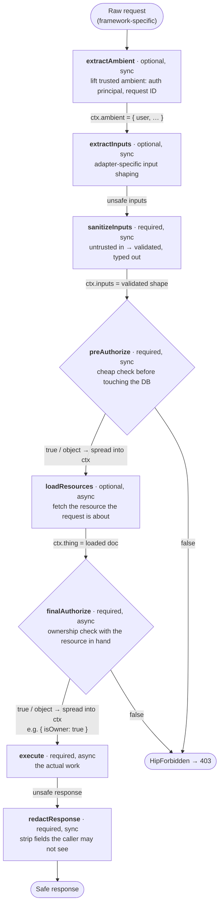
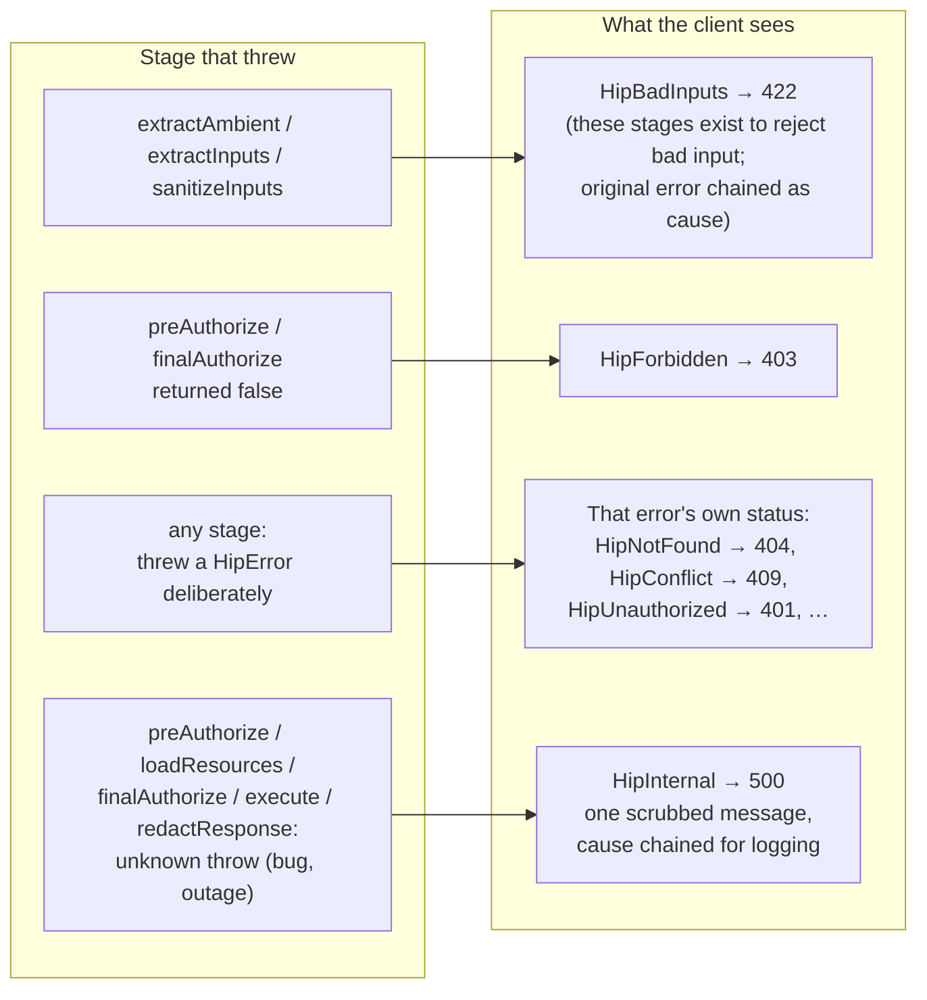
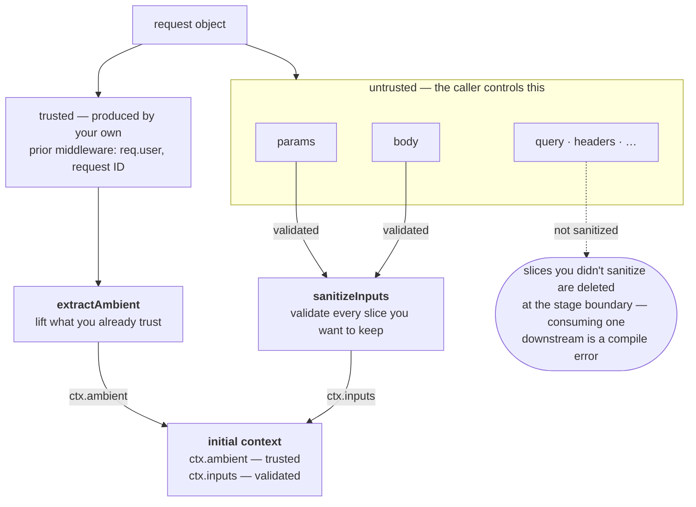
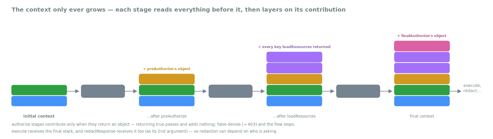
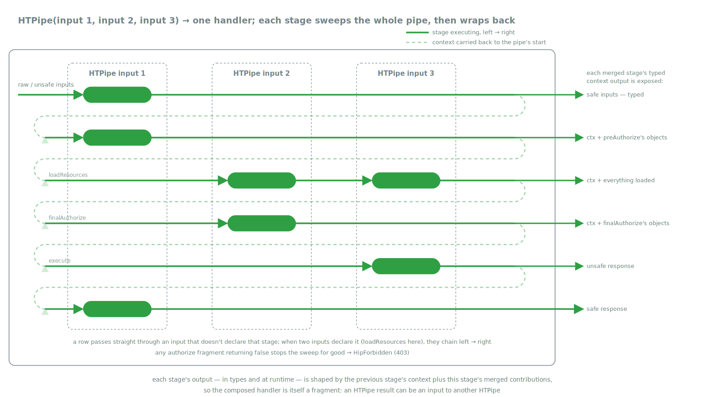

# HipThrusTS, visually

Six views that explain how HipThrusTS works and why it exists:

1. [The lifecycle](#1-the-lifecycle) — the eight stages and how flow
   control moves through them
2. [Failure routing](#2-failure-routing) — how each stage's failures map to
   client-safe responses
3. [From raw request to initial context](#3-from-raw-request-to-initial-context)
   — the trusted and untrusted halves of a request, and why unsanitized
   slices can't survive
4. [The context only grows](#4-the-context-only-grows) — how every stage
   layers its contribution onto what came before
5. [Composition with `HTPipe`](#5-composition-with-htpipe) — one request
   sweeping the whole pipe stage by stage
6. [Adapters](#6-adapters) — thin edges around a framework-free middle

Simple flows are Mermaid (GitHub renders it natively, and it's reviewed in
the same diff as the code it describes). The spatial ones — the growing
context stack, the pipe sweep, the adapter surface — are hand-drawn SVGs
in [`img/`](./img), also plain text in the diff, drawn with theme-neutral
colors so they read correctly in both GitHub light and dark mode.

## 1. The lifecycle

Every handler is the same eight stages (five required, three optional),
run in a fixed order by `executeHipthrustable`.

Authorization stages return `true` to pass, `false` to deny, or an
**object** to pass *and* contribute that object's keys to the context.

The five required stages are **mandatory by construction**: an adapter
won't accept a config that's missing one — it's a compile error, not a
code-review catch.

## 2. Failure routing

Flow control on the unhappy path is just as fixed as the happy path.
Throw a `HipError` from any stage and the adapter translates it to the
right transport response (HTTP status, or `TRPCError` code). Anything
*unexpected* thrown from a stage is routed by **which stage it escaped
from** — so a dropped DB connection can never masquerade as "not found,"
and no stack trace ever leaks to the caller.

## 3. From raw request to initial context

A request object carries two very different kinds of data, and the first
two lifecycle stages exist to keep them apart. Things the **caller
controls** (params, body, query, headers) are untrusted and must pass
through `sanitizeInputs`. Things **your own middleware produced** before
the handler ran (`req.user` from your auth layer, a request ID, a locale)
are trusted, and `extractAmbient` lifts them directly.

That drop is the **strictness guarantee**: slice sanitizers pass the raw
remainder to each other on a hidden `UNSAFE_SLICES` channel, and core
deletes that channel the moment the stage completes — at runtime *and* in
the types. Want a raw slice through anyway? Say so explicitly
(`{ query: (q) => q }`) — a visible, greppable decision instead of a
silent default.

## 4. The context only grows

From the initial context onward, every stage receives everything earlier
stages produced and layers on its own contribution. `execute` written at
the end of a long chain can reach `ctx.ambient.user`,
`ctx.inputs.params.id`, `ctx.thing`, and `ctx.isOwner` — with full type
inference.

## 5. Composition with `HTPipe`

`HTPipe(...)` merges reusable fragments — "lift the user," "sanitize
these slices," "load the Thing and require ownership" — into one complete
handler. The merge is **stage by stage, not end to end**: at runtime, each
lifecycle stage sweeps left-to-right across every input that declares it,
threading the accumulating context through; only then does the request
wrap back to the start of the pipe for the next stage.

Per-stage chaining rules, for the curious: `sanitizeInputs` and
`redactResponse` chain output→input (so redactors stack); loaders and
authorizers merge their object contributions (right wins on a key clash);
`execute` runs both and keeps the right result. And
`finishPipe(pipe, handler)` finishes the dominant authoring shape — one
shared pipe plus one endpoint-specific trailing handler — with the
trailing handler's context types inferred from the pipe, so its callbacks
need zero annotations.

## 6. Adapters

The middle is framework-free; only the edges know what framework you're
on. **Endpoint adapters** (~100 lines each) canonicalize the raw request
on the way in and translate the outcome on the way out. **Stage
factories** — Zod for validation, Mongoose for loading and redaction,
role/assignee helpers for authorization — emit fragments for one specific
stage. The same handler object runs unchanged under any of them.

