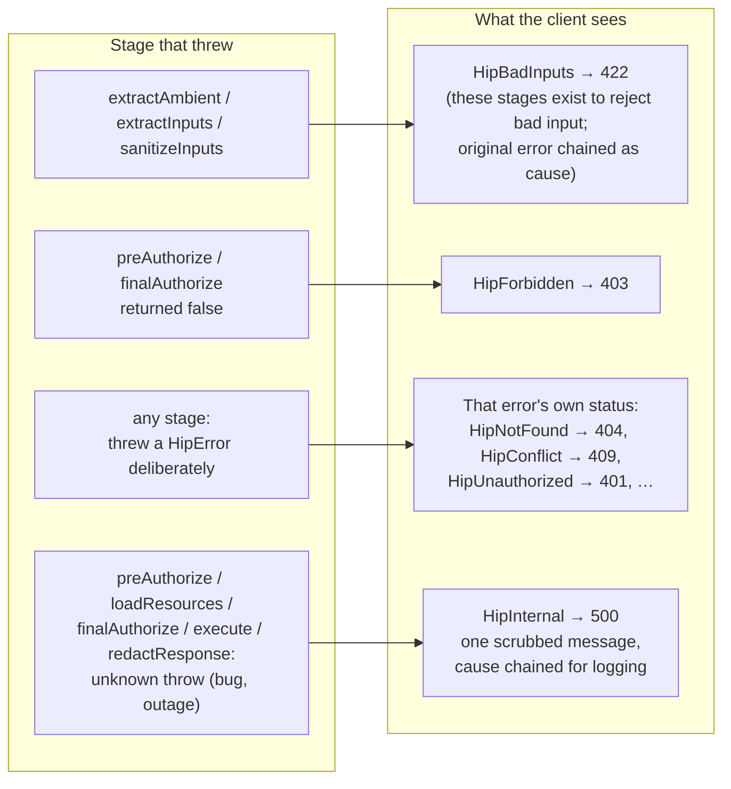
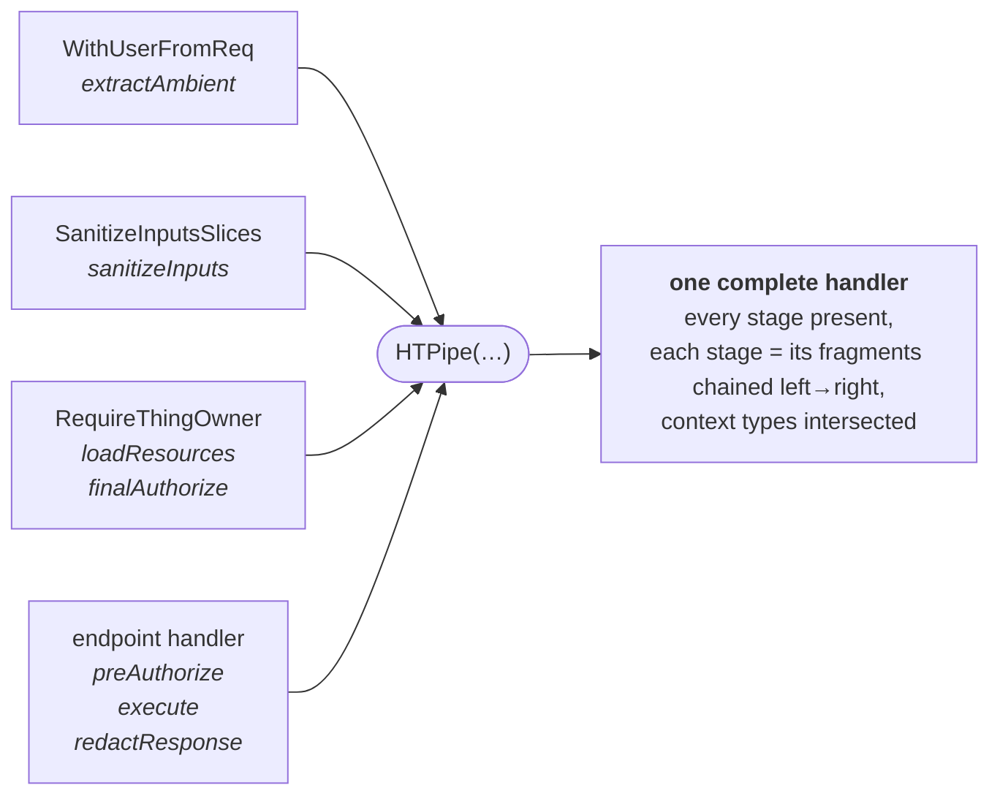
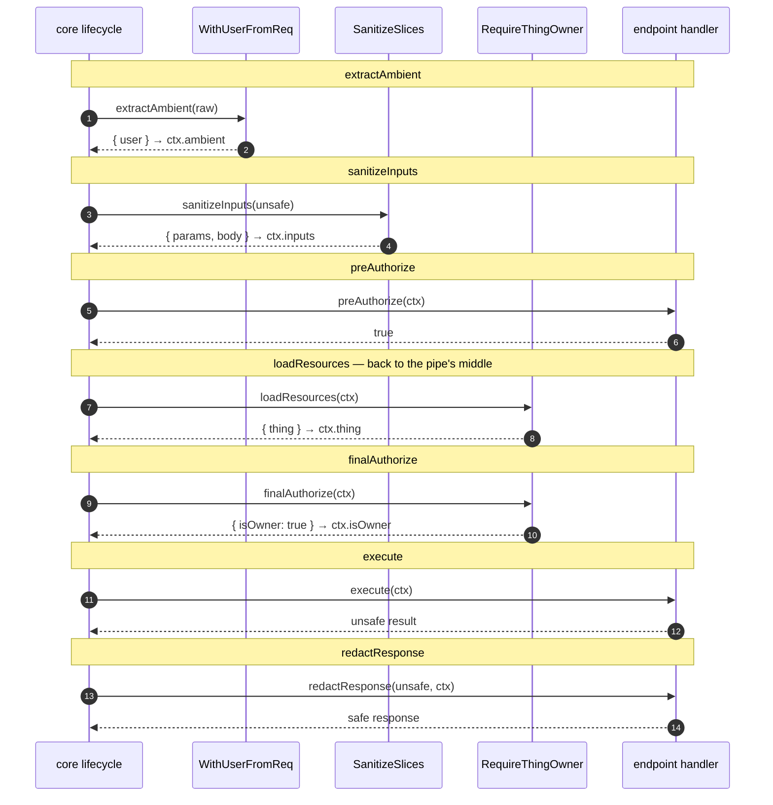
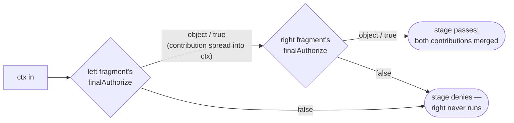
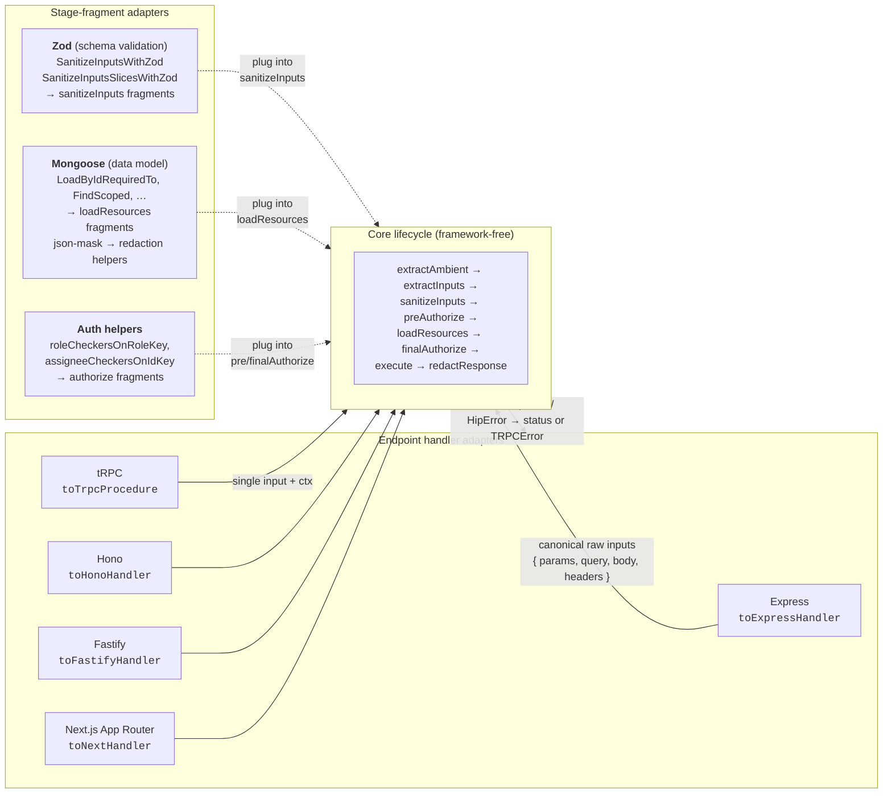
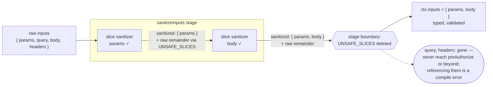

# HipThrusTS, visually

Five diagrams that explain how HipThrusTS works and why it exists:

1. [The lifecycle](#1-the-lifecycle) — the eight stages, how context
   accumulates, and how flow control moves through them
2. [Failure routing](#2-failure-routing) — how each stage's failures map to
   client-safe responses
3. [Composition with `HTPipe`](#3-composition-with-htpipe) — how fragments
   merge, and how a single request snakes across the whole pipe one
   lifecycle stage at a time
4. [Adapters](#4-adapters) — framework adapters on the outside, schema and
   data-model adapters plugged into individual stages
5. [The strictness guarantee](#5-the-strictness-guarantee) — why an
   unsanitized input slice can never reach your business logic

All diagrams are Mermaid, so GitHub renders them natively and they get
reviewed in the same diff as the code they describe.

## 1. The lifecycle

Every handler is the same eight stages (five required, three optional),
run in a fixed order by `executeHipthrustable`. The context is a plain
object that **accumulates**: each stage receives everything earlier stages
produced, and later stages can consume it with full type inference.

Authorization stages return `true` to pass, `false` to deny, or an
**object** to pass *and* contribute that object's keys to the context.

The five required stages are **mandatory by construction**: an adapter
won't accept a config that's missing one — it's a compile error, not a
code-review catch.

## 2. Failure routing

Flow control on the unhappy path is just as fixed as the happy path.
Throw a `HipError` from any stage and the adapter translates it to the
right transport response (HTTP status, or `TRPCError` code). Anything
*unexpected* thrown from a stage is routed by **which stage it escaped
from** — so a dropped DB connection can never masquerade as "not found,"
and no stack trace ever leaks to the caller.

## 3. Composition with `HTPipe`

The real payoff is writing a fragment once — "load the Thing, require the
caller to own it" — and reusing it everywhere. `HTPipe` merges fragments
**stage by stage**, not end to end:

At **runtime**, this means a single request does *not* run fragment 1
start-to-finish, then fragment 2. Instead, each lifecycle stage sweeps
left-to-right across every fragment that declares it — threading the
accumulating context through — and only then does the request move to the
next stage, back at the start of the pipe:

When **two fragments declare the same stage**, they chain within that
stage, left to right, and flow control short-circuits:

(`sanitizeInputs` chains output→input like a classic pipe;
`redactResponse` chains the same way, so redactors stack; `execute` runs
both and keeps the right result; loaders and authorizers merge their
contributions as shown.)

`finishPipe(pipe, handler)` is the ergonomic finish for the dominant
shape — one shared pipe plus one endpoint-specific trailing handler —
with the trailing handler's context types **inferred** from the pipe, so
its callbacks need zero annotations.

## 4. Adapters

The lifecycle is framework-agnostic. Three kinds of adapters plug into
it, and none of them know about each other:

- **Endpoint handler adapters** wrap the whole lifecycle for a framework
  (~100 lines each — anything else is a small PR away).
- **Schema validation adapters** produce `sanitizeInputs` fragments from
  a schema library.
- **Data-model adapters** produce `loadResources` fragments (and
  redaction helpers) from your ORM/ODM.

The framework adapter owns exactly two jobs: hand the lifecycle a
canonical raw request, and translate the outcome (safe response, or a
`HipError`) into its transport's vocabulary. Everything security-relevant
lives in the framework-free middle — which is why the same shared
fragments work unchanged across Express and tRPC.

## 5. The strictness guarantee

Slice-style sanitizers (`SanitizeInputsSlices`) hand the raw remainder to
each other under a hidden `UNSAFE_SLICES` channel, and core **deletes that
channel** when the sanitize stage completes. Only slices you explicitly
sanitized survive — at runtime *and* in the types (consuming a dropped
slice downstream is a compile error).

Want a raw slice through anyway? Say so explicitly — `{ query: (q) => q }`
is a visible, greppable decision instead of a silent default.
