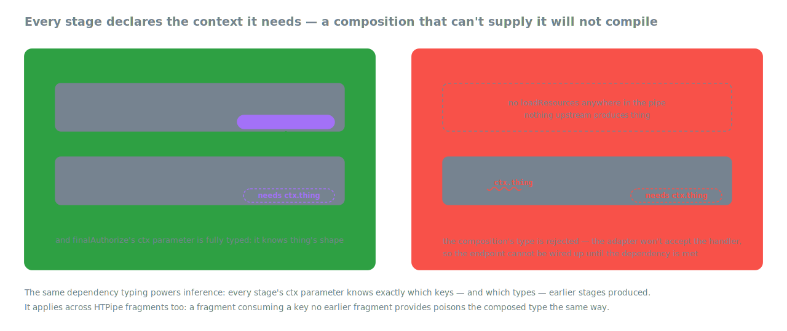

# Composition

*Part of the [HipThrusTS docs](./README.md) · [← back to the overview](../README.md)*

## Compose, don't repeat yourself

The real payoff shows up the second time you need "load a Thing by ID,
require the caller to own it." Write it once:

```ts
import { HTPipe, LoadResources, FinalAuthorize, ExtractAmbient } from 'hipthrusts';

// Lift the authenticated user out of the raw request once.
export const WithUserFromReq = ExtractAmbient((raw: { req: { user?: any } }) => ({
  user: raw.req.user,
}));

// Load the addressed Thing and require that the caller owns it.
export const RequireThingOwner = HTPipe(
  LoadResources(async (ctx: { inputs: { params: { id: string } } }) => ({
    thing: await ThingModel.findById(ctx.inputs.params.id).exec(),
  })),
  FinalAuthorize((ctx: { thing: any; ambient: { user: { id: string } } }) =>
    ctx.thing && ctx.thing.ownerId === ctx.ambient.user.id
      ? { isOwner: true as const }
      : false,
  ),
);
```

Then use it in every handler that needs it:

```ts
import { HTPipe, SanitizeInputsSlices } from 'hipthrusts';
import { toExpressHandler } from 'hipthrusts/express';

app.put('/things/:id', toExpressHandler(HTPipe(
  WithUserFromReq,                                       // ambient.user
  SanitizeInputsSlices({
    params: (p: any) => ({ id: String(p.id) }),
    body:   (b: any) => ({ name: String(b.name) }),
  }),
  RequireThingOwner,                                     // shared fragment
  {
    preAuthorize:   (ctx) => ctx.ambient.user?.role === 'editor',
    execute:        async (ctx) => {
      ctx.thing.name = ctx.inputs.body.name;
      return ctx.thing.save();
    },
    redactResponse: (t) => ({ id: t.id, name: t.name }),
  },
)));
```

`HTPipe` walks each stage left-to-right, threading the context through
and intersecting types so an `execute` written here knows it can reach
`ctx.thing`, `ctx.ambient.user`, `ctx.inputs.params.id`, and `ctx.isOwner`.

The merge is **stage by stage, not end to end**: at runtime, each
lifecycle stage sweeps left-to-right across every fragment that declares
it, threading the accumulating context through; only then does the
request wrap back to the start of the pipe for the next stage.


Note the arrows coming *out* on the right: the merge produces a real
stage per row, whose output — in types and at runtime — is the previous
stage's context plus this stage's combined contributions. That makes the
composed handler a fragment like any other: an `HTPipe` result can be an
input to another `HTPipe`.

Per-stage chaining rules, for the curious: `sanitizeInputs` and
`redactResponse` chain output→input (so redactors stack); loaders and
authorizers merge their object contributions (right wins on a key
clash); `execute` runs both and keeps the right result.

### A small routes file

The same shared fragments power every endpoint in a router:

```ts
import { HTPipe, SanitizeInputsSlices } from 'hipthrusts';
import { toExpressHandler } from 'hipthrusts/express';
import { WithUserFromReq, RequireThingOwner } from './shared';

// GET /things — public list, no resource load
thingRouter.get('/', toExpressHandler({
  sanitizeInputs:  () => ({}),
  preAuthorize:    () => true,
  finalAuthorize:  () => true,
  execute:         () => ThingModel.find({}, { _id: 1, name: 1 }).lean(),
  redactResponse:  (rows) => rows.map((r) => ({ id: r._id, name: r.name })),
}));

// GET /things/:id — owner-only read
thingRouter.get('/:id', toExpressHandler(HTPipe(
  WithUserFromReq,
  SanitizeInputsSlices({ params: (p: any) => ({ id: String(p.id) }) }),
  RequireThingOwner,
  {
    preAuthorize:   () => true,
    execute:        (ctx) => ctx.thing,
    redactResponse: (t) => ({ id: t.id, name: t.name, ownerId: t.ownerId }),
  },
)));

// PUT /things/:id — owner-only update
thingRouter.put('/:id', toExpressHandler(HTPipe(
  WithUserFromReq,
  SanitizeInputsSlices({
    params: (p: any) => ({ id: String(p.id) }),
    body:   (b: any) => ({ name: String(b.name) }),
  }),
  RequireThingOwner,
  {
    preAuthorize:   (ctx) => ctx.ambient.user?.role === 'editor',
    execute:        async (ctx) => {
      ctx.thing.name = ctx.inputs.body.name;
      return ctx.thing.save();
    },
    redactResponse: (t) => ({ id: t.id, name: t.name }),
  },
)));
```

`RequireThingOwner` was authored once and is dropped into every endpoint
that needs ownership. Adding a `/things/:id/archive` endpoint takes
roughly four lines.

### Partial pipelines are the reuse unit

The currying story: export a **partial pipeline** — auth, sanitization,
loaders, anything shared — and compose it first in every endpoint. A
typical auth pipeline lifts the (maybe-absent) principal in
`extractAmbient` (lift-only, no denial there), then denies *and*
contributes in `preAuthorize`. Contribute the whole principal — including
per-request authorization data like access rows — so later stages never
re-fetch it:

```ts
// Lift only — extraction never denies.
const WithMaybePrincipal = ExtractAmbient((raw: NextRaw) => ({
  principal: raw.principal as Principal | null, // from gatherContext
}));

// Deny AND contribute: after this, ctx.principal is non-null downstream.
const RequireAuthenticated = PreAuthorize(
  (ctx: { ambient: { principal: Principal | null } }) =>
    ctx.ambient.principal
      ? { principal: ctx.ambient.principal } // carries its access rows
      : false,
);

export const Authed = HTPipe(WithMaybePrincipal, RequireAuthenticated);
```

### finishPipe: an inferred trailing handler

Stage callbacks inside `HTPipe` fragments must declare the context they
consume — `HTPipe` infers its types FROM the fragments, so contextual
typing can't flow INTO them. For the dominant authoring shape — a shared
partial pipeline plus ONE endpoint-specific trailing handler — use
`finishPipe`: it computes the pipe's accumulated context from the pipe's
*type*, so the trailing stages need **zero annotations**:

```ts
import { finishPipe } from 'hipthrusts';

export const GET = toNextHandler(finishPipe(
  HTPipe(Authed, SanitizeInputsSlicesWithZod({ params: Params })),
  {
    loadResources:  async (ctx) => ({          // ctx fully inferred:
      thing: await ThingModel.findById(ctx.inputs.params.id).lean().exec(),
    }),                                        //   principal, inputs, ambient…
    finalAuthorize: (ctx) => ctx.thing?.ownerId === ctx.principal.id,
    execute:        (ctx) => ctx.thing,
    redactResponse: (unsafe) => unsafe,
  },
), { gatherContext });
```

Consuming a context key nothing provides is a compile error, and
pipe-internal requirements (like the scoped finders' `queryScope`) still
surface as `HipDepNotMet` at the adapter boundary. Runtime is literally
`HTPipe(pipe, handler)`.

Limitations, by design: the trailing handler may only declare
`preAuthorize` / `loadResources` / `finalAuthorize` / `execute` /
`redactResponse` / `responseMeta`. Extraction and sanitization stages
describe the pipeline's input surface — author them in the pipe. The
exported `PipeContext<typeof SomePipe>` utility computes a pipe's
accumulated context type if you need it by hand.

Division of labor with the per-adapter `defineXHandler` helpers: those
give contextual typing to a single *whole* config object (and are the
only way to get a typed adapter-raw parameter in `extractAmbient`);
`finishPipe` covers the shared-pipe-plus-trailing-handler shape. With
partial pipelines, `finishPipe` is usually the one you want.


## Type troubleshooting

The accumulation and composition above aren't just runtime behavior —
they're carried in the types. Every stage's context parameter declares
what it needs, and a handler (or pipe) whose upstream stages can't
supply a declared key is rejected at compile time:



When that happens the compiler error names the stage and key via a
branded type:

```
... is not assignable to ... HipDepNotMet<"finalAuthorize", "doc">
```

That means: `finalAuthorize` declares `ctx.doc`, and no earlier stage
(`preAuthorize` / `loadResources`) returns an object with a compatible
`doc`. Fix the provider (or the declared type), don't `as any` the
handler.

A few patterns to know:

- **Keep ORM documents narrow.** Don't let a full
  `mongoose.Document<...>` generic flow into a declared stage context —
  declare the small structural interface you actually use
  (`{ ownerId: string; save(): Promise<unknown> }`). It compiles faster
  and produces readable errors.
- **Conditional loads are fine.** `if (!doc) return {}; return { doc }`
  (a union return) counts as providing `doc`. If the consuming stage
  must handle the missing case, declare it optional/nullable there.
- **`any`-typed context keys are tolerated,** but you lose the
  guarantee that anything provides them — prefer real types.

