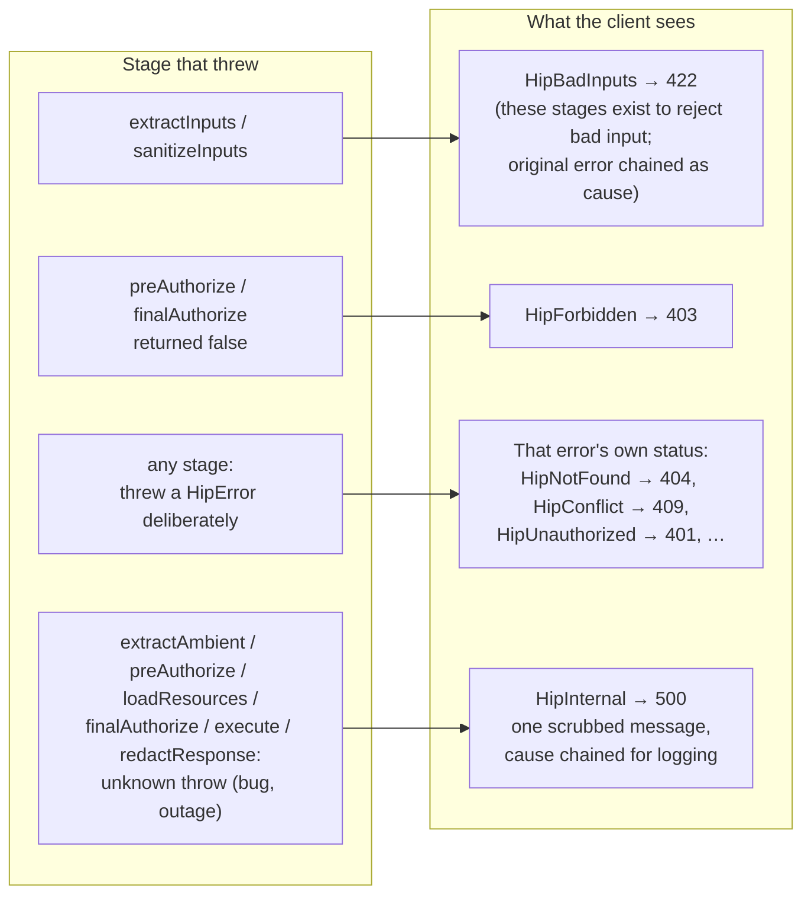

# Errors & failure routing

*Part of the [HipThrusTS docs](./README.md) · [← back to the overview](../README.md)*

Flow control on the unhappy path is just as fixed as the happy path.
Throw a `HipError` from any stage and the adapter translates it to the
right transport response (HTTP status, or propagation for tRPC).
Anything *unexpected* thrown from a stage is routed by **which stage it
escaped from** — so a dropped DB connection can never masquerade as "not
found," and no stack trace ever leaks to the caller.




The lifecycle has a small, semantic error vocabulary. Throw one of these
from any stage and the adapter takes care of the HTTP details:

| Throw                | HTTP                  | Meaning                                          |
|----------------------|-----------------------|--------------------------------------------------|
| `HipBadInputs(msg)`  | 422                   | Input validation failed.                         |
| `HipUnauthorized()`  | 401                   | No authenticated principal.                      |
| `HipForbidden()`     | 403                   | Authenticated, but not permitted.                |
| `HipNotFound()`      | 404                   | A required resource is missing.                  |
| `HipConflict()`      | 409                   | The request conflicts with current state.        |
| `HipInternal()`      | 500                   | Unexpected failure (default for anything else).  |
| `new HipRedirect(u)` | 302 (or what you set) | Control-flow signal; HTTP-style adapters honor.  |

Every HTTP adapter (**Express / Hono / Fastify / Next.js**) responds
directly with the mapped status and a JSON body. If you'd rather have
your own express error middleware handle errors, pass
`{ delegateErrors: true }` to `toExpressHandler` — every error (the
`HipError` itself, or the raw unknown exception) is forwarded to
`next()`, and `hipErrorToStatus` / `hipErrorToBody` from
`hipthrusts/errors` do the translation in your middleware. The **tRPC**
adapter lets `HipError` propagate with its `.kind`; map it in your
`errorFormatter` if you want specific `TRPCError` codes.

## What the error body contains

The HTTP error body is `{ error, issues?, detail? }`:

- `error` — the message, always.
- `issues` — when the error's `detail` is a `ZodError` (as thrown by the
  zod helpers), it is projected to `[{ path, message }]` so forms can
  render per-field errors. Paths and messages only — received input
  values never reach the wire.
- `detail` — arbitrary structured payload, included **only** when the
  error was constructed with the explicit opt-in:

  ```ts
  throw new HipConflict('blocked by open items', { blockedBy }, { expose: true });
  // -> 409 { "error": "blocked by open items", "detail": { "blockedBy": [...] } }
  ```

`HipInternal` never exposes `issues` or `detail`, opt-in or not.

## Unexpected errors

Anything thrown that *isn't* a `HipError` is scrubbed and routed by
stage. The input stages (`extractInputs` / `sanitizeInputs`) map unknown
throws to `422` (they exist to reject bad input — a raw `schema.parse()`
works fine there). Every other stage — `extractAmbient`, `preAuthorize`,
`loadResources`, `finalAuthorize`, `execute` — maps them to a `500` with
the body `{ "error": "Internal server error" }`, because an unexpected
throw there is an app bug or infra failure, not a client-attributable
outcome. In particular `extractAmbient` runs *before* any input is
validated and merely lifts trusted ambient (auth principal, request id,
locale) off the raw request, so a crash there says nothing about the
caller's input and is deliberately **not** a `422` (nor a default `401` —
an outage in ambient extraction must not masquerade as an auth failure).
The original error is chained as `Error.cause` on the `HipError`, so the
adapters' `onError` hook (see
[Adapter options](./adapters.md#adapter-options)) can log the real
failure.

A *deliberate* status from `extractAmbient` stays fully expressible: throw
a `HipError` (e.g. `HipUnauthorized`) and it passes through unwrapped —
this is what powers the auth-before-validation gate below.

> **403 vs 404:** `finalAuthorize` returning `false` is always a `403`.
> If "the resource doesn't exist" should read as `404`, throw
> `HipNotFound` from `loadResources` (the mongoose helper
> `findByIdRequired` does exactly this). A `loadResources` that merely
> returns nothing is NOT a 404 by itself.

## Rejecting a caller before validating their inputs (the auth gate)

The default lifecycle validates first: `extractInputs` / `sanitizeInputs`
run before `preAuthorize`, so an unauthenticated caller who also sends a
malformed payload sees the `422` before the `401`. That ordering is the
right default — many teams want it — but it is not universal. The other
camp of the perennial 422-vs-401 debate wants authentication checked
*first*, so an anonymous caller is turned away without their inputs ever
being examined.

You don't need a framework flag or a lifecycle reorder to get it. Because
`extractAmbient` is the **first** stage and a thrown `HipError` passes
through every stage unwrapped, a tiny `extractAmbient` fragment that
*rejects* (rather than merely lifting) turns the endpoint into
auth-first — and, composed with `HTPipe`, opts in per endpoint:

```ts
import { HTPipe, ExtractAmbient, PreAuthorize } from 'hipthrusts';
import { HipUnauthorized } from 'hipthrusts/errors';

// A gate: extractAmbient runs before any input stage, so throwing here
// makes the 401 precede any 422. HipUnauthorized passes through unwrapped.
const RequireAuthenticated = ExtractAmbient(
  (raw: { principal: Principal | null }) => {
    if (!raw.principal) throw new HipUnauthorized('Please sign in');
    return { principal: raw.principal }; // narrowed: non-null downstream
  },
);

// A trivial preAuthorize lift keeps the contributed principal visible to
// later stages exactly as the validate-first `Authed` pipeline does.
const CarryPrincipal = PreAuthorize(
  (ctx: { ambient: { principal: Principal } }) => ({
    principal: ctx.ambient.principal,
  }),
);

// Auth-first: 401 before 422. Compare with the validate-first `Authed`
// pipeline in docs/composition.md, which lifts a maybe-null principal and
// denies in preAuthorize (so input validation runs first). Same
// primitives — the only difference is WHERE the rejection lives.
export const AuthedFirst = HTPipe(RequireAuthenticated, CarryPrincipal);
```

Both orderings fall out of the same primitives: keep the rejection in
`preAuthorize` for validate-first, move it up into `extractAmbient` for
auth-first. Neither camp needs a framework change.

What the gate does **not** preempt: the HTTP adapters read and JSON-parse
the request body, and run `gatherContext`, *before* the lifecycle starts.
So a malformed JSON body can still produce a `422` (or a `gatherContext`
failure its own error) ahead of the gate's `401`; the gate governs stage
ordering, not the transport-level parse that precedes every stage.

