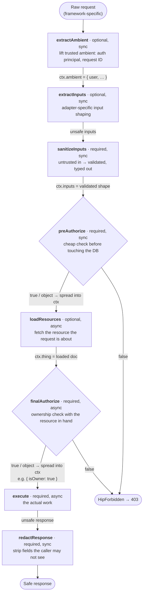
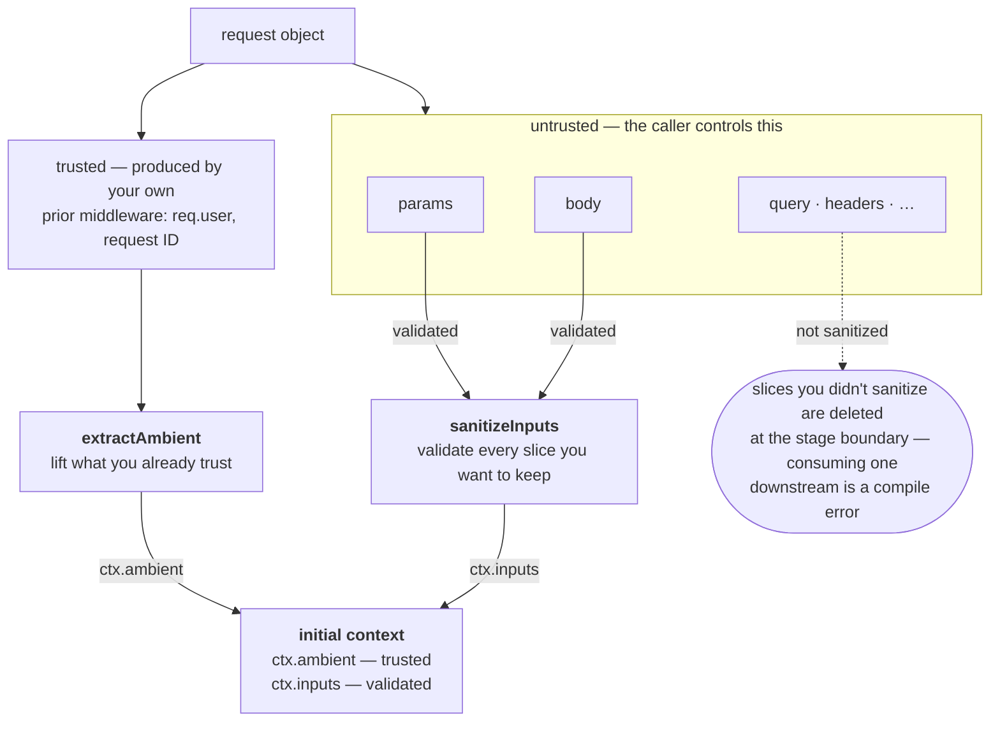

# The lifecycle, in detail

*Part of the [HipThrusTS docs](./README.md) · [← back to the overview](../README.md)*

Every handler is the same eight stages (five required, three optional),
run in a fixed order by the adapter. Authorization stages return `true`
to pass, `false` to deny, or an **object** to pass *and* contribute that
object's keys to the shared context.



The five required stages are **mandatory by construction**: an adapter
won't accept a config that's missing one — it's a compile error, not a
code-review catch.

Every handler config is a plain object. Five methods are required; three
are optional. Each method receives a `context` that accumulates as the
request progresses, so a later stage sees everything earlier stages
returned.

| Stage             | Req? | Async? | Receives                       | Use this for…                                              |
|-------------------|------|--------|--------------------------------|------------------------------------------------------------|
| `extractAmbient`  | no   | sync   | raw request                    | lift trusted ambient (auth principal, request ID, locale)  |
| `extractInputs`   | no   | sync   | adapter-canonical raw inputs   | adapter-specific input shaping (rarely needed)             |
| `sanitizeInputs`  | yes  | sync   | unsafe inputs                  | validate untrusted user input against your schema          |
| `preAuthorize`    | yes  | sync   | `{ inputs, ambient }`          | cheap check before touching the database                   |
| `loadResources`   | no   | async  | everything so far              | fetch the resource the request is about                    |
| `finalAuthorize`  | yes  | async  | everything so far              | ownership/permission check with the resource in hand       |
| `execute`         | yes  | async  | everything so far              | the actual work (mutate, compute, save)                    |
| `redactResponse`  | yes  | sync   | unsafe response, final context | strip secrets/internal fields before sending               |

`extractAmbient`'s output lives at `ctx.ambient`. `sanitizeInputs`'s output
lives at `ctx.inputs`. Outputs from `preAuthorize` / `loadResources` /
`finalAuthorize` are spread at the top level of `ctx`.

Authorization stages return `true` to pass, `false` to deny, or an
**object** to pass *and* contribute that object to the context. So
`finalAuthorize` can do its check and produce the resource role at the
same time:

```ts
finalAuthorize: (ctx) =>
  ctx.thing.ownerId === ctx.ambient.user.id
    ? { isOwner: true as const }
    : false,
```

…and `execute` will see `ctx.isOwner` with full type information.

`redactResponse` optionally takes the final context as a second
argument, so redaction can depend on the caller — no need to smuggle
authorization flags through the `execute` return value:

```ts
finalAuthorize: (ctx) => ({ canSeeEmails: ctx.ambient.user.role === 'admin' }),
execute:        (ctx) => ({ rows: ctx.rows }),
redactResponse: (unsafe, ctx: { canSeeEmails: boolean }) =>
  ctx.canSeeEmails ? unsafe.rows : unsafe.rows.map(({ email, ...rest }) => rest),
```

### Input slices & the strictness guarantee

`sanitizeInputs` is single-slot: one function, unsafe in, safe out —
which is exactly right for tRPC's single `input`. HTTP-style adapters
feed it the canonical `{ params, query, body, headers }` object, and
`SanitizeInputsSlices` gives you per-slice ergonomics on top:

```ts
SanitizeInputsSlices({
  params: (p) => ParamsSchema.parse(p),
  body:   (b) => BodySchema.parse(b),
})
```

**Only slices you explicitly sanitize survive the stage.** Chained
sanitize fragments hand the raw remainder to each other under the
`UNSAFE_SLICES` symbol, and core deletes that channel once the stage
completes — so an unsanitized `query` never reaches `preAuthorize` or
anything after it, at runtime *or* in the types (consuming it downstream
is a compile error). Want a raw slice through? Say so explicitly:
`{ query: (q) => q }`. A plain whole-object sanitizer
(`sanitizeInputs: (i) => …`) is likewise an explicit mapping — whatever
it returns is, by definition, sanitized.


### From raw request to initial context, visually

A request object carries two very different kinds of data, and the first
stages exist to keep them apart. Things the **caller controls** (params,
body, query, headers) are untrusted and must pass through
`sanitizeInputs`. Things **your own middleware produced** before the
handler ran (`req.user` from your auth layer, a request ID, a locale)
are trusted, and `extractAmbient` lifts them directly.



Next: [Composition](./composition.md) — sharing these stages across
endpoints — and [Errors](./errors.md) — how every failure is routed.
